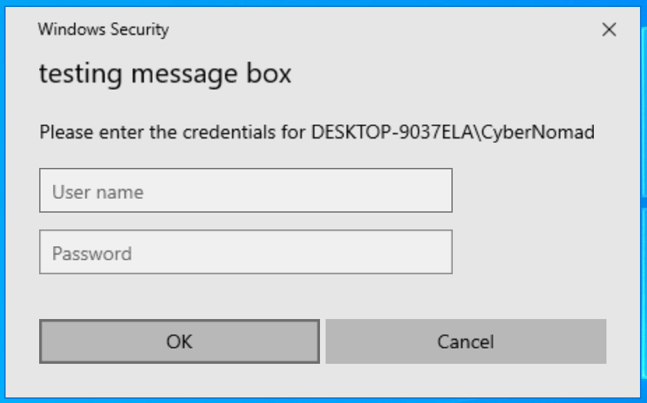
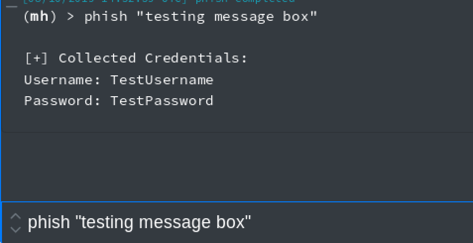

# CovenantTasks
Bunch of covenant tasks i've hacked together from various bits of code etc. I'm about as far from an expert in how to use the Covenant C2 'correctly' as well as C# as possible. All code is created from a 'it worked when I tried it' perspective.


|File   	|Description   	|  Credit|
|---	|---	| ---|
|CredPhisher|Prompts user for credentials| [matterpreter OffensiveCSharp](https://github.com/matterpreter/OffensiveCSharp)|

---

## CredPhisher
**Execution**

``` phish "message you want to display to user" ```

 

**Setup**
1. Add 'CredPhisher.cs' file to the following directory 'Covenant/Data/ReferenceSourceLibraries/SharpSploit/SharpSploit/Credentials'
2. Use the code in phisher.task to either create a persistant task (based upon Cobbr's instructions in the Covenant Repo) or use the web interface to create a new and paste it into the code section setting 'message' as a command line option and SharpSploit under 'ReferenceSourceLibraries'.

---
